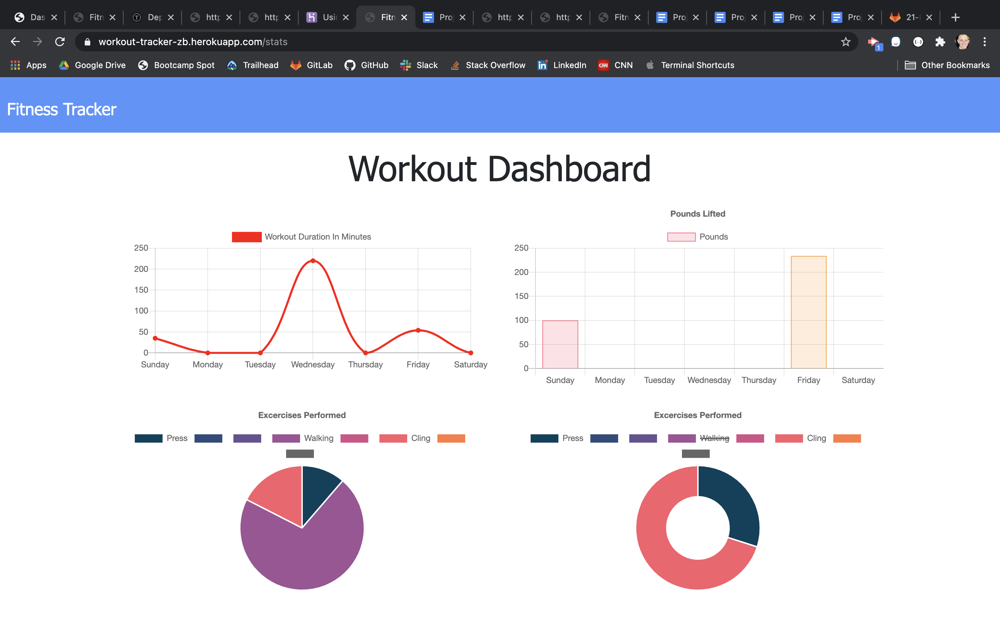

# WORKOUT TRACKER

[Find this app here](https://workout-tracker-zb.herokuapp.com/)
---
## Description

This app is designed to track your workouts! User inputs workout data:
- exercise type: cardio vs resistance
- includes fields for exercise name, time, and weight.

---
### Table of Contents

* [Description](#description)
* [Installation](#installation)
* [Contributing](#contributing)
* [Questions](#questions)
* [Usage](#usage)
* [License](#licence)

---
### Installation

This project can be accessed through any internet capable browser. If you would like to modify the code itself:
* Run npm install to get all dependencies
* Spin up a MongoDB database: Locally or Cloud Service such as MongoDB Atlas.
* Declare personal connection string as URI in a .env file within the base directory

---
### Contributing

- [Plover Brown](https://github.com/rebgrasshopper)
- [Kira Bismuth Lowrey](https://github.com/KILowrey)
- [Nancy Lambert-Brown](https://github.com/n-lambert)
- [Mando Estrada](https://github.com/Mando619)
- [Perry Theobald](https://github.com/perrytjr)
- [Jeneth Diestra](https://github.com/jen6one9)
- [Matthew Rogers](https://github.com/Rogers-Development-Services)
- [Jefrrey Choi](https://github.com/jepoy92)
- [Clyde Baron Rapinan](https://github.com/clydebaron2000)
- [Johnny Lieu](https://github.com/johnnylieu)
- [Robert Graham](https://github.com/Robmgraham)

---
### Questions

For any additional questions or update requests please contact me via [Email](zacharybryan@icloud.com)

Find some of my other projects here!
[zacharybryan](https://www.github.com/zacharybryan)

---
### Usage

You may use this code in any way you please that follows the GNU license

---
### License

GNU General Public License v3.0

---
Copyright (c) 2020 Zachary Bryan
